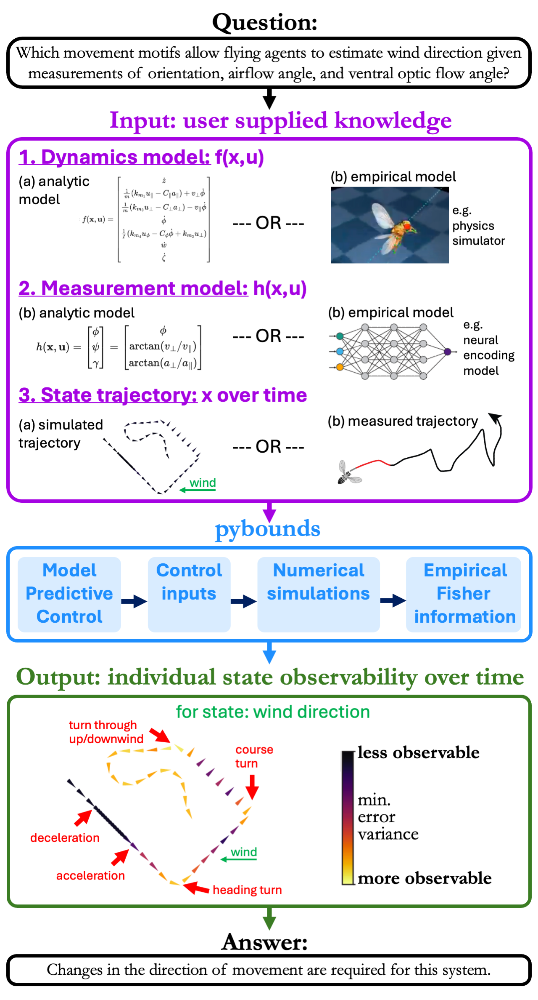

# pybounds

Python implementation of BOUNDS: Bounding Observability for Uncertain Nonlinear Dynamic Systems.

<p align="center">
    <a href="https://pypi.org/project/pybounds/">
        </a>
</p>

## Introduction

This repository provides python code to empirically calculate the observability level of individual states for a nonlinear (partially observable) system, and accounts for sensor noise. Below is a graphical example of how pybounds can discover active sensing motifs. Minimal working examples are described below. 




## Installing

The package can be installed by cloning the repo and running python setup.py install from inside the home pybounds directory.

Alternatively using pip
```bash
pip install pybounds
```

## Notebook examples

For a simple system:
*  [](https://colab.research.google.com/github/vanbreugel-lab/pybounds/blob/main/examples/mono_camera_example.ipynb) Monocular camera with optic fow measurements: [mono_camera_example.ipynb](examples%2Fmono_camera_example.ipynb)

For a more complex system:
*  [](https://colab.research.google.com/github/vanbreugel-lab/pybounds/blob/main/examples/fly_wind_example.ipynb) Fly-wind: [fly_wind_example.ipynb](examples%2Ffly_wind_example.ipynb)

## Citation

If you use the code or methods from this package, please cite the following paper:

Cellini, B., Boyacioglu, B., Lopez, A., & van Breugel, F. (2025). Discovering and exploiting active sensing motifs for estimation (arXiv:2511.08766). arXiv. https://arxiv.org/abs/2511.08766

## Additional resources

To learn more about nonlinear observability, its relation to Fisher information, see [Boyacioglu and van Breugel](https://ieeexplore.ieee.org/abstract/document/10908645)

To start with the basics, check out these open source course materials: [Nonlinear and Data Driven Estimation](https://github.com/florisvb/Nonlinear_and_Data_Driven_Estimation).


## Related packages

This repository is the evolution of the EISO repo (https://github.com/BenCellini/EISO), and is intended as a companion to the repository directly associated with the paper above.

## License

This project utilizes the [MIT LICENSE](LICENSE.txt).
100% open-source, feel free to utilize the code however you like. 
