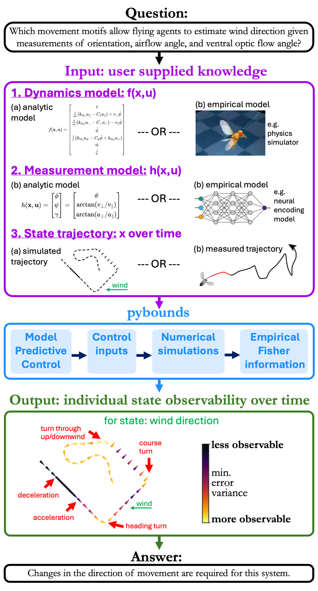

# pybounds

Python implementation of BOUNDS: Bounding Observability for Uncertain Nonlinear Dynamic Systems.

<p align="center">
    <a href="https://pypi.org/project/pybounds/">
        </a>
    <a href="https://github.com/vanbreugel-lab/pybounds/actions/workflows/tests.yaml">
        </a>
    <a href="https://codecov.io/gh/vanbreugel-lab/pybounds">
        </a>
</p>

## Introduction

This repository provides python code to empirically calculate the observability level of individual states for a nonlinear (partially observable) system, and accounts for sensor noise. Below is a graphical example of how pybounds can discover active sensing motifs. Minimal working examples are described below.



## Installing

The package can be installed from PyPi:

```bash
pip install pybounds
```

or from source, for development, after cloning the repo:

```
pip install -e .
```

## Quick Start

```python
import numpy as np
import matplotlib.pyplot as plt
import pybounds

# 1. Define system dynamics f(X, U) and measurement h(X, U)
def f(X, U):        # states: gap g, distance d — input u drives g
    return [U[0], 0]

def h(X, U):        # monocular camera measures the g/d ratio
    return [X[0] / X[1]]

# 2. Simulate a trajectory
sim = pybounds.Simulator(f, h, dt=0.01,
                         state_names=['g', 'd'], input_names=['u'],
                         measurement_names=['r'])
t, x, u, _ = sim.simulate(x0={'g': 2.0, 'd': 3.0},
                           u={'u': 0.1 * np.ones(500)},
                           return_full_output=True)

# 3. Compute sliding-window observability and Fisher information
ev = pybounds.compute_observability(sim, t, x, u, R={'r': 0.1})

# 4. Plot minimum error variance over time for each state
ev.set_index('time')[['g', 'd']].plot(logy=True, ylabel='Min. error variance')
plt.show()
```

## Notebook examples

For a simple system:
*  [](https://colab.research.google.com/github/vanbreugel-lab/pybounds/blob/main/examples/mono_camera_example.ipynb) Monocular camera with optic flow measurements: [mono_camera_example.ipynb](examples%2Fmono_camera_example.ipynb)

For a more complex system:
*  [](https://colab.research.google.com/github/vanbreugel-lab/pybounds/blob/main/examples/fly_wind_example.ipynb) Fly-wind: [fly_wind_example.ipynb](examples%2Ffly_wind_example.ipynb)

### JAX Accelerated Examples

pybounds includes a JAX backend (`JaxSimulator`, `JaxSlidingEmpiricalObservabilityMatrix`) that replaces the numerical finite-difference Jacobian with exact autodiff via `jax.vmap` + `jax.jacfwd`. The simulation and all downstream analysis (Fisher information, plotting) are unchanged.

**When JAX helps most:** the speedup scales with the number of sliding windows. Short trajectories with few windows see modest gains; long trajectories benefit dramatically.

| System | States | Windows | Legacy | JAX (hot) | Speedup |
|--------|-------:|-------:|-------:|----------:|--------:|
| Mono-camera | 2 | 895 | ~21 s | ~1.1 s | **~19×** |
| Fly-wind | 18 | 37 | ~6 s | ~2.6 s | **~2.4×** |

**To use the JAX backend**, install JAX and rewrite your dynamics `f` and measurement `h` using `jax.numpy` instead of `numpy`. See the notebooks below for worked examples.

*  [](https://colab.research.google.com/github/vanbreugel-lab/pybounds/blob/claude_explorations/examples/mono_camera_example_jax.ipynb) Mono-camera — JAX accelerated: [mono_camera_example_jax.ipynb](examples%2Fmono_camera_example_jax.ipynb)
*  [](https://colab.research.google.com/github/vanbreugel-lab/pybounds/blob/claude_explorations/examples/fly_wind_example_jax.ipynb) Fly-wind — JAX accelerated: [fly_wind_example_jax.ipynb](examples%2Ffly_wind_example_jax.ipynb)

## Citation

If you use the code or methods from this package, please cite the following paper:

Cellini, B., Boyacioglu, B., Lopez, A., & van Breugel, F. (2025). Discovering and exploiting active sensing motifs for estimation (arXiv:2511.08766). arXiv. https://arxiv.org/abs/2511.08766

## Additional resources

To learn more about nonlinear observability, its relation to Fisher information, see [Boyacioglu and van Breugel](https://ieeexplore.ieee.org/abstract/document/10908645)

To start with the basics, check out these open source course materials: [Nonlinear and Data Driven Estimation](https://github.com/florisvb/Nonlinear_and_Data_Driven_Estimation).

## Related packages

This repository is the evolution of the EISO repo (https://github.com/BenCellini/EISO), and is intended as a companion to the repository directly associated with the paper above.

## License

This project utilizes the [MIT LICENSE](LICENSE.txt).
100% open-source, feel free to utilize the code however you like.
