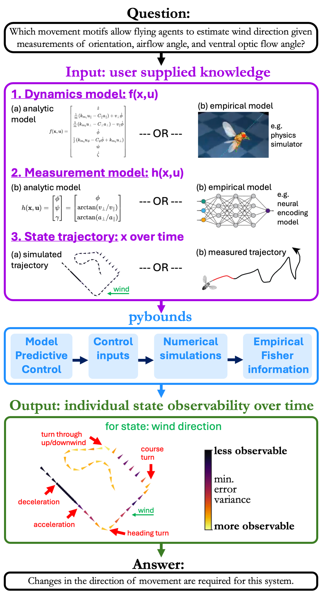

# pybounds

Python implementation of BOUNDS: Bounding Observability for Uncertain Nonlinear Dynamic Systems.

<p align="center">
    <a href="https://pypi.org/project/pybounds/">
        </a>
    <a href="https://github.com/vanbreugel-lab/pybounds/actions/workflows/tests.yaml">
        </a>
    <a href="https://codecov.io/gh/vanbreugel-lab/pybounds">
        </a>
    <a href="https://pybounds.readthedocs.io/en/latest/">
        </a>
</p>

## Introduction

This repository provides python code to empirically calculate the observability level of individual states for a nonlinear (partially observable) system, and accounts for sensor noise. Below is a graphical example of how pybounds can discover active sensing motifs. Minimal working examples are described below.



## Installing

The package can be installed from PyPi:

```bash
pip install pybounds
```

or from source, for development, after cloning the repo:

```
pip install -e .
```

## Quick Start

To demonstrate pybounds with a simple example we use a downward-pointing camera moving horizontally with acceleration that is controlled directly with control inputs (u). The two states are ground speed `g` and (constant) altitude `d`, and the only measurement is the ventral optic flow ratio `r = g/d`. We use pybounds to understand when `g` and `d` are observable. 

See notebooks in next section for more detailed usage examples. 

```python
import numpy as np
import matplotlib.pyplot as plt
import pybounds

# 1. Define continuous time system dynamics f(X, U) and measurement h(X, U)
def f(X, U):         # states: gap g, distance d — input u drives g
    return [U[0], 0] # returns: d/dt(g), d/dt(d) 

def h(X, U):        # monocular camera measures the g/d ratio
    return [X[0] / X[1]]

# 2. Simulate a trajectory
sim = pybounds.Simulator(f, h, dt=0.01,
                         state_names=['g', 'd'], input_names=['u'],
                         measurement_names=['r'])
t, x, u, _ = sim.simulate(x0={'g': 2.0, 'd': 3.0},
                           u={'u': 0.1 * np.ones(500)},
                           return_full_output=True)

# 3. Set up the observability analysis (nothing is computed yet), then run it
oa = pybounds.ObservabilityAnalysis(sim, t, x, u, w=6, R={'r': 0.1}, lam=1e-8)
oa.run()

# 4. Plot minimum error variance over time for each state
ev = oa.min_error_variance()
ev.set_index('time')[['g', 'd']].plot(logy=True, ylabel='Min. error variance')
plt.show()
```

- **Window:** `w` is the sliding-window length in time-steps. Without it, the whole trajectory is analyzed as one window.
- **Noise:** `R` is the measurement noise variance, per sensor.
- **Regularization `lam` (λ):** the Fisher information matrix F is inverted as (F + λI)⁻¹. `1e-8` is also the default. 1/λ is the ceiling on the minimum error variance: a state whose error variance sits near 1/λ (1e8 by default) is unobservable, not merely poorly estimated. λ is an absolute value, so it should be small compared to the eigenvalues of F, which depend on the sensor noise R and on the units of each state.
- **One-call shortcut:** `pybounds.compute_observability(sim, t, x, u, R={'r': 0.1}, w=6, lam=1e-8)` returns the same result as steps 3 and 4 in a single call, without keeping the analysis.

### Selecting states, and saving settings and results

`oa` keeps the observability matrices from `run()`, so you can ask about different selections without recomputing them:

```python
# Drop a state: treat d as known and ask how well g alone can be estimated
ev_g = oa.min_error_variance(states=['g'])

# Other selections and parameters work the same way
ev_short = oa.min_error_variance(time_steps=[0, 1, 2])   # only the first 3 steps of each window
ev_noisy = oa.min_error_variance(R={'r': 1.0})           # a different noise level

# Save every setting to YAML, and load it into another analysis later
oa.save_settings('observability_settings.yaml')
oa2 = pybounds.ObservabilityAnalysis(sim, t, x, u).load_settings('observability_settings.yaml')

# Save results for a selection into a directory: min_error_variance.csv, a YAML sidecar
# (selection, full state/sensor lists, settings) and, optionally, all observability matrices (.npz)
oa.save_results('results_g', states=['g'], include_observability_matrices=True)
```

- **Dropping a state is conditional:** the states you leave out are treated as known, so the remaining ones usually look more observable than when every state is estimated together.
- **Changing settings:** `update_settings(...)` changes settings before or after `run()`. Changing anything that affects the observability matrices (e.g. `w`, `eps`, `z_function`) discards the results until you call `run()` again; changing `R` or `lam` does not.
- **Backends:** `method` picks how the observability matrices are built: `'empirical'` (finite differences) or `'jax'` (autodiff). It is chosen automatically from the simulator type.
- **Memory:** `run()` keeps every window's observability matrix (8·n_windows·w·p·n bytes). For long windows, `storage='fisher_per_sensor'` keeps each sensor's Fisher information instead, which is smaller when w > (n+1)/2 and still supports selecting states and sensors with a scalar or per-sensor R. With `method='jax'`, `batch_size=...` computes windows in chunks to cap JAX's memory. See [the storage design note](docs/design/observability_storage.md).

## Notebook examples

### Basic Examples

These notebooks provide a more detailed example of pybounds functionality including: 
* How to use model predictive control to drive systems along specified trajectories 
* Demonstration of what happens inside the `pybounds.compute_observability` wrapper function, allowing for detailed investigations of the observability calculations

**Examples using pybounds with continuous time dynamics**, see these notebook examples:
*  [](https://colab.research.google.com/github/vanbreugel-lab/pybounds/blob/main/examples/mono_camera_example.ipynb) Monocular camera with optic flow measurements: [mono_camera_example.ipynb](examples/mono_camera_example.ipynb)
*  [](https://colab.research.google.com/github/vanbreugel-lab/pybounds/blob/main/examples/fly_wind_example.ipynb) Fly-wind: [fly_wind_example.ipynb](examples/fly_wind_example.ipynb)

### JAX Accelerated Examples

pybounds includes a JAX backend (`JaxSimulator`, `JaxSlidingEmpiricalObservabilityMatrix`) that replaces the numerical finite-difference Jacobian with exact autodiff via `jax.vmap` + `jax.jacfwd`. The simulation and all downstream analysis (Fisher information, plotting) are unchanged.

**When JAX helps most:** the speedup scales with the number of sliding windows. Short trajectories with few windows see modest gains; long trajectories benefit dramatically.

| System | States | Windows | Legacy | JAX (hot) | Speedup |
|--------|-------:|-------:|-------:|----------:|--------:|
| Mono-camera | 2 | 895 | ~21 s | ~1.1 s | **~19×** |
| Fly-wind | 18 | 37 | ~6 s | ~2.6 s | **~2.4×** |

**To use the JAX backend**, install JAX and rewrite your dynamics `f` and measurement `h` using `jax.numpy` instead of `numpy`. See the notebooks below for worked examples.

*  [](https://colab.research.google.com/github/vanbreugel-lab/pybounds/blob/main/examples/mono_camera_example_jax.ipynb) Mono-camera — JAX accelerated: [mono_camera_example_jax.ipynb](examples/mono_camera_example_jax.ipynb)
*  [](https://colab.research.google.com/github/vanbreugel-lab/pybounds/blob/main/examples/fly_wind_example_jax.ipynb) Fly-wind — JAX accelerated: [fly_wind_example_jax.ipynb](examples/fly_wind_example_jax.ipynb)

### Using a Custom Simulator

This has received the least development, however, a working tutorial can be found [here](https://github.com/florisvb/Nonlinear_and_Data_Driven_Estimation/blob/main/Lesson_8_Empirical_Nonlinear_Observability/C_pybounds_with_custom_simulator_tutorial.ipynb).

## Citation

If you use the code or methods from this package, please cite the following paper:

Cellini, B., Boyacioglu, B., Lopez, A., & van Breugel, F. (2025). Discovering and exploiting active sensing motifs for estimation (arXiv:2511.08766). arXiv. https://arxiv.org/abs/2511.08766

## Additional resources

To learn more about nonlinear observability, its relation to Fisher information, see [Boyacioglu and van Breugel](https://ieeexplore.ieee.org/abstract/document/10908645)

To start with the basics, check out these open source course materials: [Nonlinear and Data Driven Estimation](https://github.com/florisvb/Nonlinear_and_Data_Driven_Estimation).

## Related packages

This repository is the evolution of the EISO repo (https://github.com/BenCellini/EISO), and is intended as a companion to the repository directly associated with the paper above.

## License

This project utilizes the [MIT LICENSE](LICENSE.txt).
100% open-source, feel free to utilize the code however you like.
